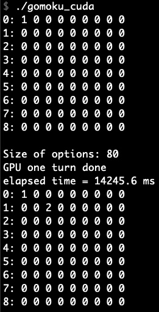
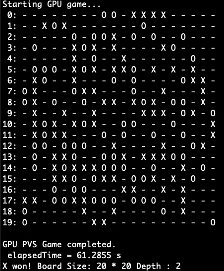

**CIS631 Final Project, Fall 2020**

**Taught by: Professor Jee Choi**

**Authors: Yuya Kawakami & Haoran Wang**

Please email us if there is any problem. hwang8@uoregon.edu or
ykawakam@uoregon.edu

# **Parallel AI Gomoku**
Parallelize Gomoku use OpenMP and CUDA (4 approaches). To change board size and depth, please edit "BOARD_SIZE" and "DEPTH" variables inside the code.

## Note
- Please do not run board size larger than 24 or depth higher than 4. It will take a lot of time and resources.
- For convenience purposes, in this commit, all the programs are set to a smaller problem size that can be run within ~30 seconds.

### Contents
| Programs | Description |
| ------ | ------ |
| gomoku_serial | serial implementation |
| gomoku_omp | OpenMP implementation|
| gomoku_cuda_naive | naive CUDA implementation |
| gomoku_cuda_seq | Sequential Parallelism CUDA implementation |
| gomoku_cuda_pvs | PVS CUDA implementation |
| gomoku_cuda_dynamic | dynamic CUDA parallelism implementation |

### CUDA Environment Requirement
* CUDA Version: 11.1
* CUDA Libraries: -lcudart -lcublas -lcurand -lcusolver -lcudadevrt (for dynamic parallelism)
* We recommend using GPU with at least 8GB memory. We used Tesla K80, V100 and RTX 2080 for our experiments.

### To Run
For convenience purposes, each method is compiled into a single executable.
```sh
$ ./gomoku_omp
$ ./gomoku_cuda_naive
$ ./gomoku_cuda_seq
$ ./gomoku_cuda_pvs
$ ./gomoku_cuda_dynamic
```

The result contains final board state, the winner of the game, time it took to finish the game, Board Size and Depth.

### Experiment: Test one step


### Experiment: Test the whole game


